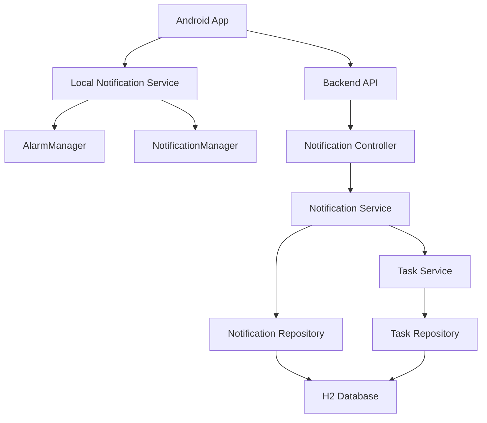
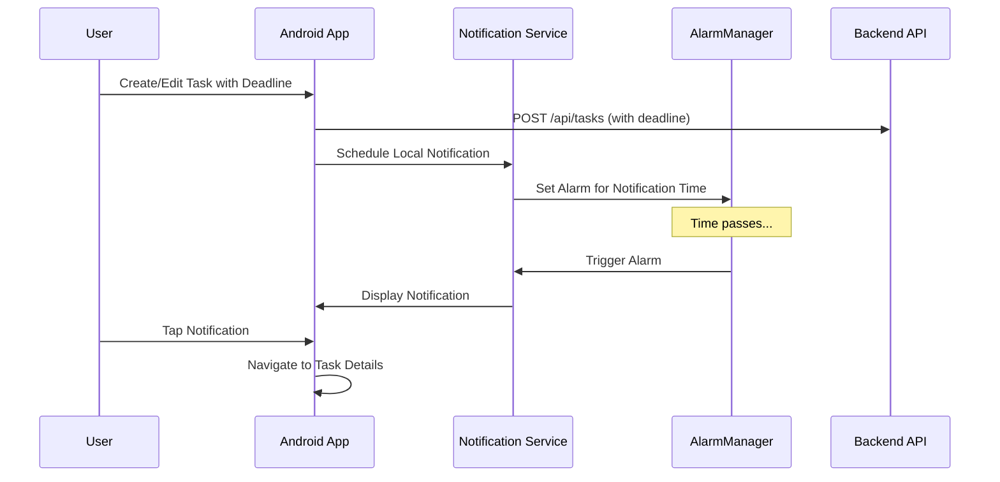

# Design Document

## Overview

The Task Deadline Notifications system will be implemented as a hybrid solution combining Android local notifications with backend scheduling support. The design leverages Android's AlarmManager and NotificationManager for reliable local notifications, while the Spring Boot backend provides centralized notification scheduling and management through a REST API.

The system follows a dual-layer approach:
- **Local Layer**: Android handles immediate notification delivery and user interactions
- **Backend Layer**: Spring Boot manages notification schedules, preferences, and synchronization across potential future clients

## Architecture

### High-Level Architecture



### Component Interaction Flow



## Components and Interfaces

### Android Components

#### NotificationService
- **Purpose**: Manages local notification scheduling and delivery
- **Key Methods**:
  - `scheduleTaskDeadlineNotification(Task task, long notificationTime)`
  - `cancelTaskNotifications(long taskId)`
  - `rescheduleTaskNotifications(Task task)`
  - `handleNotificationTap(Intent intent)`

#### NotificationReceiver (BroadcastReceiver)
- **Purpose**: Handles alarm triggers and system events
- **Key Methods**:
  - `onReceive(Context context, Intent intent)` - processes alarm triggers
  - `onBootCompleted()` - restores notifications after device restart

#### NotificationPreferencesManager
- **Purpose**: Manages user notification preferences
- **Key Methods**:
  - `getDefaultNotificationTiming()`
  - `setDefaultNotificationTiming(long millisBefore)`
  - `isNotificationsEnabled()`
  - `getNotificationHistory()`

#### NotificationChannelManager
- **Purpose**: Manages Android notification channels for different priority levels
- **Channels**:
  - `URGENT_DEADLINE` - High priority, sound + vibration
  - `NORMAL_DEADLINE` - Medium priority, sound only
  - `REMINDER_DEADLINE` - Low priority, silent
  - `OVERDUE_TASK` - Critical priority, persistent notification

### Backend Components

#### NotificationController
- **Purpose**: REST API endpoints for notification management
- **Endpoints**:
  - `POST /api/notifications/schedule` - Schedule notification
  - `DELETE /api/notifications/{taskId}` - Cancel notifications
  - `GET /api/notifications/preferences` - Get user preferences
  - `PUT /api/notifications/preferences` - Update preferences
  - `GET /api/notifications/history` - Get notification history

#### NotificationService (Backend)
- **Purpose**: Business logic for notification management
- **Key Methods**:
  - `scheduleNotification(NotificationRequest request)`
  - `cancelNotifications(Long taskId)`
  - `updateNotificationPreferences(NotificationPreferences prefs)`
  - `getNotificationHistory(String userId)`

#### NotificationScheduler
- **Purpose**: Handles backend-side notification scheduling using Spring's @Scheduled
- **Key Methods**:
  - `processScheduledNotifications()` - Runs every minute to check for due notifications
  - `cleanupExpiredNotifications()` - Daily cleanup of old notification records

## Data Models

### Android Models

```java
public class NotificationRequest {
    private long taskId;
    private String taskTitle;
    private String taskDescription;
    private long deadlineTime;
    private long notificationTime;
    private NotificationPriority priority;
    private List<Long> additionalNotificationTimes;
}

public class NotificationPreferences {
    private boolean notificationsEnabled;
    private long defaultNotificationTiming; // milliseconds before deadline
    private boolean soundEnabled;
    private boolean vibrationEnabled;
    private List<Long> customNotificationIntervals;
}

public enum NotificationPriority {
    LOW, MEDIUM, HIGH, CRITICAL
}
```

### Backend Models

```java
@Entity
public class NotificationSchedule {
    @Id
    @GeneratedValue(strategy = GenerationType.IDENTITY)
    private Long id;
    
    private Long taskId;
    private String userId;
    private LocalDateTime scheduledTime;
    private LocalDateTime createdAt;
    private NotificationStatus status;
    private NotificationPriority priority;
    private String notificationContent;
}

@Entity
public class NotificationHistory {
    @Id
    @GeneratedValue(strategy = GenerationType.IDENTITY)
    private Long id;
    
    private Long taskId;
    private String userId;
    private LocalDateTime sentAt;
    private LocalDateTime dismissedAt;
    private NotificationAction action; // SENT, DISMISSED, SNOOZED, CLICKED
    private String deviceInfo;
}

@Entity
public class UserNotificationPreferences {
    @Id
    private String userId;
    
    private boolean notificationsEnabled;
    private long defaultTimingMinutes;
    private boolean soundEnabled;
    private boolean vibrationEnabled;
    
    @ElementCollection
    private List<Long> customIntervals;
}
```

## Error Handling

### Android Error Scenarios
1. **Permission Denied**: Handle notification permission gracefully with user prompts
2. **AlarmManager Limitations**: Use exact alarms for critical notifications, inexact for others
3. **Battery Optimization**: Guide users to whitelist app from battery optimization
4. **Storage Issues**: Implement fallback when local storage is full

### Backend Error Scenarios
1. **Database Connection Issues**: Implement retry logic with exponential backoff
2. **Task Not Found**: Return appropriate HTTP status codes and error messages
3. **Invalid Notification Times**: Validate notification scheduling parameters
4. **Concurrent Modifications**: Handle race conditions in notification scheduling

### Error Response Format
```json
{
    "error": {
        "code": "NOTIFICATION_SCHEDULE_FAILED",
        "message": "Unable to schedule notification for past deadline",
        "details": {
            "taskId": 123,
            "requestedTime": "2024-01-01T10:00:00Z",
            "currentTime": "2024-01-02T10:00:00Z"
        }
    }
}
```

## Testing Strategy

### Unit Testing
- **Android**: Test notification scheduling logic, preference management, and receiver functionality
- **Backend**: Test service layer methods, repository operations, and controller endpoints
- **Mock Dependencies**: Use Mockito for AlarmManager, NotificationManager, and database operations

### Integration Testing
- **API Testing**: Test complete notification workflow from task creation to notification delivery
- **Database Testing**: Verify notification persistence and retrieval operations
- **Cross-Component Testing**: Test Android-Backend synchronization

### End-to-End Testing
- **Notification Delivery**: Automated tests for notification appearance and timing
- **User Interaction**: Test notification tap handling and app navigation
- **Background Operation**: Verify notifications work when app is backgrounded/closed

### Performance Testing
- **Notification Volume**: Test system behavior with large numbers of scheduled notifications
- **Battery Impact**: Monitor battery usage during notification operations
- **Memory Usage**: Ensure notification service doesn't cause memory leaks

### Test Data Management
- Use in-memory H2 database for backend testing
- Create test fixtures for various notification scenarios
- Implement test utilities for time manipulation and notification verification