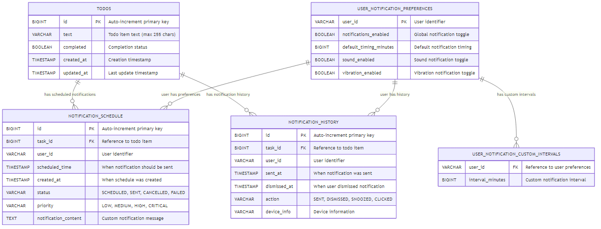
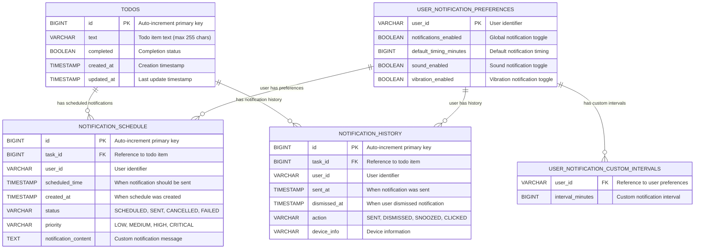

# TodoApp Entity-Relationship Diagram

## Database Schema Overview

This document contains the Entity-Relationship (ER) diagram for the TodoApp project, showing the relationships between all entities in the system.

## ER Diagram

### Visual PNG Version

*For high-resolution version, see [er-diagram-hd.png](er-diagram-hd.png)*

### Interactive Mermaid Version

## Entity Descriptions

### TODOS
The main entity representing todo items in the system.
- **Primary Key**: `id` (Auto-increment)
- **Business Logic**: Tracks todo items with completion status and timestamps
- **Validation**: Text field is required and limited to 255 characters

### NOTIFICATION_SCHEDULE
Manages scheduled notifications for todo items.
- **Primary Key**: `id` (Auto-increment)
- **Foreign Key**: `task_id` references `TODOS.id`
- **Business Logic**: Stores when and how notifications should be sent
- **Status Values**: SCHEDULED, SENT, CANCELLED, FAILED
- **Priority Values**: LOW, MEDIUM, HIGH, CRITICAL

### NOTIFICATION_HISTORY
Tracks the history of sent notifications and user interactions.
- **Primary Key**: `id` (Auto-increment)
- **Foreign Key**: `task_id` references `TODOS.id`
- **Business Logic**: Records notification delivery and user responses
- **Action Values**: SENT, DISMISSED, SNOOZED, CLICKED

### USER_NOTIFICATION_PREFERENCES
Stores user-specific notification settings.
- **Primary Key**: `user_id` (String identifier)
- **Business Logic**: Manages user preferences for notifications
- **Default Values**: Notifications enabled, 60-minute default timing

### USER_NOTIFICATION_CUSTOM_INTERVALS
Stores custom notification intervals for users.
- **Composite Key**: `user_id` + `interval_minutes`
- **Foreign Key**: `user_id` references `USER_NOTIFICATION_PREFERENCES.user_id`
- **Business Logic**: Allows users to define custom notification timings

## Relationship Details

### One-to-Many Relationships

1. **TODOS → NOTIFICATION_SCHEDULE** (1:N)
   - One todo item can have multiple scheduled notifications
   - Allows for multiple reminder notifications per task

2. **TODOS → NOTIFICATION_HISTORY** (1:N)
   - One todo item can have multiple notification history records
   - Tracks all notification interactions for each task

3. **USER_NOTIFICATION_PREFERENCES → USER_NOTIFICATION_CUSTOM_INTERVALS** (1:N)
   - One user can have multiple custom notification intervals
   - Supports flexible notification timing preferences

4. **USER_NOTIFICATION_PREFERENCES → NOTIFICATION_SCHEDULE** (1:N)
   - One user can have multiple scheduled notifications
   - Links user preferences to their scheduled notifications

5. **USER_NOTIFICATION_PREFERENCES → NOTIFICATION_HISTORY** (1:N)
   - One user can have multiple notification history records
   - Tracks all notification interactions per user

## Indexes and Performance

### Recommended Indexes
- `NOTIFICATION_SCHEDULE`: `task_id`, `user_id`, `scheduled_time`, `status`
- `NOTIFICATION_HISTORY`: `task_id`, `user_id`, `sent_at`, `action`
- `USER_NOTIFICATION_CUSTOM_INTERVALS`: `user_id`

### Query Optimization
- Composite indexes on frequently queried combinations
- Timestamp indexes for time-based queries
- Status indexes for filtering active notifications

## Data Integrity Constraints

### Foreign Key Constraints
- `NOTIFICATION_SCHEDULE.task_id` → `TODOS.id`
- `NOTIFICATION_HISTORY.task_id` → `TODOS.id`
- `USER_NOTIFICATION_CUSTOM_INTERVALS.user_id` → `USER_NOTIFICATION_PREFERENCES.user_id`

### Check Constraints
- `NOTIFICATION_SCHEDULE.status` must be in ('SCHEDULED', 'SENT', 'CANCELLED', 'FAILED')
- `NOTIFICATION_SCHEDULE.priority` must be in ('LOW', 'MEDIUM', 'HIGH', 'CRITICAL')
- `NOTIFICATION_HISTORY.action` must be in ('SENT', 'DISMISSED', 'SNOOZED', 'CLICKED')

## Future Considerations

### Potential Extensions
1. **USER** entity for user management and authentication
2. **CATEGORIES** entity for todo categorization
3. **TAGS** entity with many-to-many relationship to todos
4. **SHARED_TODOS** for collaborative features
5. **NOTIFICATION_TEMPLATES** for customizable notification messages

### Scalability Considerations
- Partition large tables by user_id or date ranges
- Archive old notification history records
- Consider NoSQL for high-volume notification data